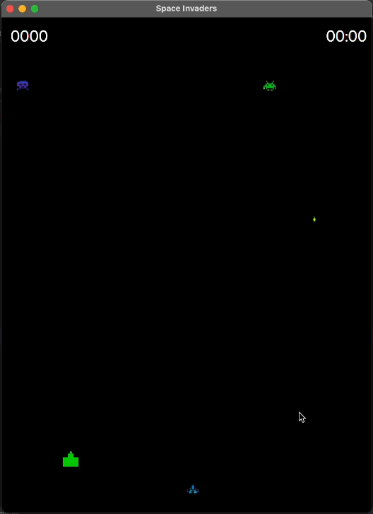
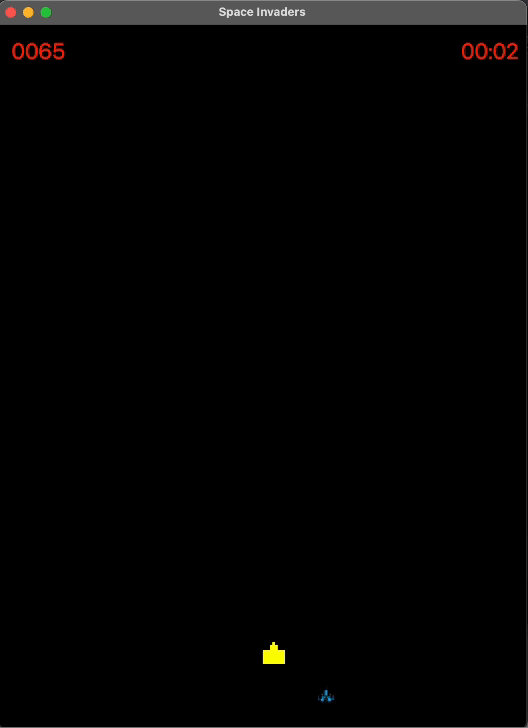
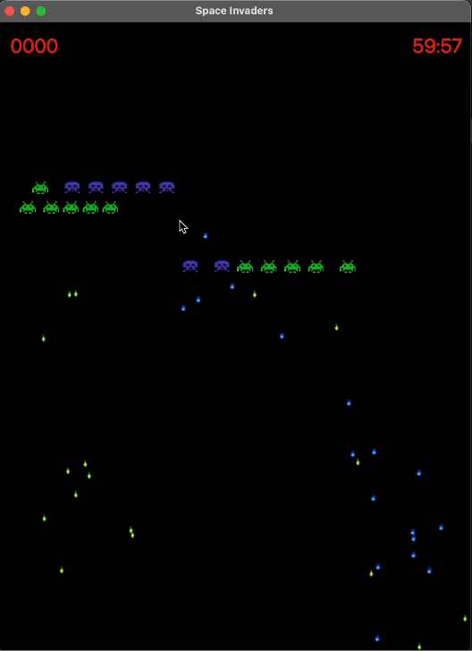

# Invaders Game

## Table of Contents
**[Overview](#Overview)**<br>
**[Dependencies](#Dependencies)**<br>
**[Execute](#Execute)**<br>
**[Features Full Version](#Features-Full-Version)**<br>
**[References](#References)**<br>
**[Acknowledgements](#Acknowledgements)**<br>

## Overview
Space Invaders is a 1978 shoot 'em up arcade video game developed and released by Taito in Japan. The goal is to defeat wave after wave of descending aliens with a horizontally moving laser to earn as many points as possible. Here's an [example](https://www.youtube.com/watch?v=uGjgxwiemms).

We are recreating Space Invaders using JavaFX and Gradle, and implementing it with 7 different design patterns, including Builder, Factory, State, Strategy, Singleton, Facade and Memento.

## Getting Started

### Dependencies

* JDK 17
* Gradle 7.4

### Execute

`cd` into `javafx-invaders-game` then `cd` into either:

* invaders-full-ver
* invaders-partial

```
gradle clean build run
```

## Features-Full-Version
* **[Switch difficulty](#Difficulties)**<br>
* **[Cheat](#Cheat)**<br>
* **[Undo](#Undo)**<br>

### Difficulties

* You can switch difficulty at any time during the game.
* The default mode is `Easy` as in `config_easy.json`

* The game will restart with new difficulty level:

  * Press `Z` for `easy`
  * Press `X` for `medium`
  * Press `C` for `hard`

<p align='center'>
  
</p>

### Cheat

The player can do a cheating operation to remove all aliens projectile of the same type or all the alien's who have the same strategy immediately. 

* Score won't increase when game ends (`red`)
* But Alien and Projectile will still be removed regardless.

  * Press `A` to remove `slow enemy projectile` (1 points)
  * Press `S` to remove `fast enemy projectile` (2 points)
  
  <p align='center'>
    
  </p>

  * Press `Q` to remove `slow alien` (3 points)
  * Press `W` to remove `fast alien` (4 points)

  <p align='center'>
    
  </p>

## Undo

* The player can reset the game to an earlier state (including score, time, alien's position and alien projectile's position) so that a shot can be undo.
* Only 1 state is saved at a time.

  * Press `O` to save
  * Press `P` to undo

  <p align='center'>
    
  </p>

## Design pattern

  <p align='center'>
    
  </p>

* **Builder** - *invaders.builder.**

  * **Functionality**: Create enemies and bunkers.

  * `Director`:            Director.java
  * `Builder`:             Builder.java
  * `ConcreteBuilder`:     EnemyBuilder.java
                           BunkerBuilder.java
  * `Product`:             Enemy.java
                           Bunker.java

* **Factory** - *invaders.factory.**

  * **Functionality**: Create projectiles.

  * `Product`:             Projectile.java
  * `ConcreteProduct`:     PlayerProjectile.java
                           EnemyProjectile.java
  * `Creator`:             ProjectileFactory.java
  * `ConcreteCreator`:     PlayerProjectileFactory.java
                           EnemyProjectileFactory.java

* **State** - *invaders.state.**

  * **Functionality**: Represent state (color changes) of each bunker.

  * `Context`:             Bunker.java
  * `State`:               BunkerState.java
  * `ConcreteState`:       GreenState.java
                           YellowState.java
                           RedState.java

* **Strategy** - *invaders.strategy.**

  * **Functionality**: Identify the behaviour of projectiles.

  * `Strategy`:            ProjectileStrategy.java
  * `ConcreteStrategy`:    SlowProjectileStrategy.java
                           FastProjectileStrategy.java
                           NormalProjectileStrategy.java
  * `Context`:             Projectile.java
    
* **Singleton** - *invaders.singleton.GameEngine*

  * **Functionality**: Identify difficulty level.
    
  * `Singleton`:          GameEngine.java

* **Facade** - *invaders.facade.**
  
  * **Functionality**: Show current time and score.

  * `Facade`:             LabelFacade.java
  * `Subsystem classes`:  Clock.java
                          Score.java

* **Memento** - *invaders.memento.** and *invaders.singleton.GameEngine*

  * **Functionality**: Undo

  * `Memento`:            Memento.java
  * `Caretaker`:          Caretaker.java
  * `Originator`:         GameEngine.java

### References

Bunkers https://www.vecteezy.com/vector-art/7641789-pixel-art-play-button

Bullet https://flyclipart.com/image-bullet-png-586005
https://es.pixilart.com/art/blue-laser-bullet-4fdcaf91e0b9e2a
https://www.pixilart.com/art/laserbeam-d509f00ae2bee5e

Alien https://freepngimg.com/png/32291-space-invaders-transparent-picture
https://spaceinvaders.fandom.com/wiki/Crab_(Medium_Invader)
https://www.hiclipart.com/free-transparent-background-png-clipart-qqtdj

Player https://freepngimg.com/games/space-invaders
https://www.pngwing.com/en/search?q=space+invaders
https://www.pinpng.com/picture/Toxwxh_2d-spaceship-png-spaceinvaders-sprite-transparent-png/

Java https://stackoverflow.com/questions/37104215/error-exception-in-thread-javafx-application-thread
https://forums.oracle.com/ords/apexds/post/convert-string-to-color-object-6876

USYD https://canvas.sydney.edu.au/courses/53385/modules https://edstem.org/au/courses/12969/discussion/

Singleton https://medium.com/divar-mobile-engineering/use-singleton-pattern-or-not-282b197a2e9f 
https://stackoverflow.com/quesIons/8549825/singleton-with-subclassing-in-java 
https://medium.com/aia-sg-techblog/why-singleton-pattern-is-considered-as-anI-design-pattern-c81dd8b7e757
https://www.youtube.com/watch?v=4NZq_LzI-tQ 
https://www.youtube.com/watch?v=hUE_j6q0LTQ 
https://www.youtube.com/watch?v=tSZn4wkBIu8

SOLID https://medium.com/swlh/solid-design-principles-the-simplest-explanaIon-8df7164308f5 
https://www.linkedin.com/advice/3/how-do-you-use-design-patterns-frameworks-support-1e
https://medium.com/@kedren.villena/simplifying-dependency-inversion-principle-dip-59228122649a

Façade https://embeddedarIstry.com/blog/2020/07/06/managing-complexity-with-the-mediator-and-facade-patterns/ 
https://sevenhillstechnology.com/programming/high-cohesion-low-coupling/ 
https://www.youtube.com/watch?v=K4FkHVO5iac&t=206s 
https://www.youtube.com/watch?v=xWk6jvqyhAQ

GRASP
https://stackoverflow.com/quesIons/3085285/difference-between-cohesion-and-coupling
https://blog.knoldus.com/solid-open-closed-principle/#:~:text=being%20too%20broad.-,Open%2FClosed%20Principle(OCP)%20%E2%80%93,funcIonality%20(and%20vice%20versa).
https://home.cs.colorado.edu/~kena/classes/5448/f12/presentaIon-materials/rao.pdf https://www.pearsonhighered.com/assets/samplechapter/0/1/3/0/0130925691.pdf
https://www.youtube.com/watch?v=fGNF6wuD-fg&list=LL&index=3&t=179s

Memento https://dotnettutorials.net/lesson/memento-design-pattern-in-java/ 
https://www.youtube.com/watch?v=_Q5rXfGuyLQ&t=209sOOP 
https://medium.com/@cancerian0684/what-are-four-basic-principles-of-object-oriented-programming-645af8b43727#:~:text=There%20are%204%20major%20principles,pillars%20of%20Object%20Oriented%20Programming.
https://www.indeed.com/career-advice/career-development/what-is-object-oriented-programming

UML https://www.conceptdraw.com/How-To-Guide/uml-class-diagram-constructor 
https://www.cs.bsu.edu/homepages/pvgestwicki/misc/uml/?rclid=IwAR3b2u_pE_jYwCcyKgnazK0ehz-DEMBsgor63HzYhqZ7IKFkHZ2btohpUUc

Builder 
https://stackoverflow.com/quesIons/23169505/java-best-way-to-implement-builder-pattern 
https://stackoverflow.com/quesIons/13720801/does-the-builder-design-pattern-violate-the-single-responsibility-principle
https://refactoring.guru/design-patterns/builder https://stackoverflow.com/quesIons/4313172/builder-design-pattern-why-do-we-need-a-director 
https://stackoverflow.com/quesIons/7302891/the-builder-pattern-and-a-large-number-of-mandatory-parameters

Factory https://stackoverflow.com/quesIons/46512199/factory-method-pattern-solid 
https://www.linkedin.com/pulse/building-solid-foundaIons-using-factory-pattern-object-ahmed-fares 
https://www.cleancode.studio/design-patterns/interface-segregaIon-design-pattern 
https://stackify.com/interface-segregaIon-principle/ 
https://medium.com/@ReganKoopmans/understanding-the-grasp-design-patterns-2cab23c7226e                         
https://www.pentalog.com/blog/design-patterns/factory-method-design-pattern/#:~:text=Loose%20coupling%20%E2%80%93%20The%20Factory%20Method,modular%20and%20easier%20to%20maintain. 
https://www.youtube.com/watch?v=EcFVTgRHJLM&t=32s

State https://springframework.guru/gang-of-four-design-patterns/state-pattern/#:~:text=In%20this%20post%2C%20I%20will,of%20the%20SOLID%20design%20principles.

https://refactoring.guru/design-patterns/state 
https://deviq.com/design-patterns/state-design-pattern https://www.learncsdesign.com/learn-the-state-design-pattern/ https://www.geeksforgeeks.org/state-design-pattern/ https://www.youtube.com/watch?v=N12L5D78MAA

Strategy https://medium.com/@alana.almeida.brandao/design-patterns-grasp-and-solid-6ef3ba09dfdf#:~:text=GRASP%20patterns&text=Another%20approach%20that%20could%20be,those%20classes%20can%20be%20interchangeable. https://www.linkedin.com/pulse/strategy-designpattern-majid-ahmadi 
https://www.javatpoint.com/strategy-pattern 
https://www.youtube.com/watch?v=v9ejT8FO-7I&t=365s

### Acknowledgement

The codebase is provided by unit **SOFT2201 - University of Sydney.**
